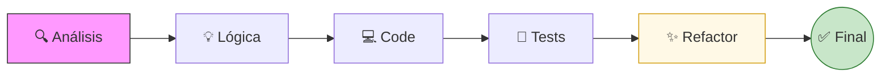

# 🐍 Python Problem Solving: CodeWars & Algorithmic Logic

  

  
  
  

---

## 📖 Resumen Ejecutivo
Este repositorio es una bitácora técnica de resolución de desafíos (**Katas**). No es solo una colección de scripts, sino un entrenamiento continuo en **eficiencia algorítmica** y **pensamiento lateral**. Cada solución ha sido refactorizada para cumplir con los estándares de legibilidad y rendimiento del ecosistema Python.

---

## 🛠️ Metodología de Resolución
Para asegurar la calidad de cada entrega, se aplica un flujo de trabajo de ingeniería de software:

## 📁 Índice de Desafíos Destacados
## 📁 Índice de Desafíos y Soluciones
*Explora las soluciones haciendo clic en el icono 🐍 al final de cada fila.*

| Nivel | Desafío / Kata | Concepto Aplicado | Solución |
| :--- | :--- | :--- | :---: |
|  | **Maximum subarray sum** | Programación Dinámica | [🐍](./5%20kyu%20-%20Maximum%20subarray%20sum.py) |
|  | **Bit Counting** | Operaciones Bitwise | [🐍](./6%20kyu%20-%20Bit%20Counting.py) |
|  | **Replace With Alphabet Position** | Manipulación de Strings | [🐍](./6%20kyu%20-%20Replace%20With%20Alphabet%20Position.py) |
|  | **Cat years, Dog year** | Lógica de Control | [🐍](./8%20kyu%20-%20Cat%20years,%20Dog%20year.py) |
|  | **Compare within margin** | Operadores de Comparación | [🐍](./8%20kyu%20-%20Compare%20within%20margin.py) |
|  | **Get the mean of an array** | Aritmética / Listas | [🐍](./8%20kyu%20-%20Get%20the%20mean%20of%20an%20array.py) |
|  | **Grasshopper - Ifelse syntax** | Debugging / Sintaxis | [🐍](./8%20kyu%20-%20Grasshopper%20-%20Ifelse%20syntax%20debug.py) |
|  | **Quarter of the year** | Lógica Matemática | [🐍](./8%20kyu%20-%20Quarter%20of%20the%20year.py) |
|  | **Reversed Words** | Transformación de Texto | [🐍](./8%20kyu%20-%20Reversed%20Words.py) |
|  | **String cleaning** | Limpieza de Datos | [🐍](./8%20kyu%20-%20String%20cleaning.py) |

---

---

## 🛠️ Toolbox de Ingeniería (Pythonic Skills)
Para cada desafío en este repositorio, se prioriza el uso de herramientas nativas que optimizan el rendimiento:

* **Optimización:** Implementación de *List Comprehensions* y manejo de memoria en ejercicios de nivel intermedio (5 y 6 kyu).
* **Limpieza de Código:** Aplicación de principios **DRY** y nombrado semántico de variables.
* **Dominio Lógico:** Resolución de problemas complejos como los **Números de Hamming** y **Números Infelices** mediante algoritmos eficientes.
---

## ⚖️ Código de Honor y Uso Ético
> [!IMPORTANT]
> Este repositorio tiene fines **estrictamente educativos**. El verdadero crecimiento técnico ocurre cuando te enfrentas al problema por tu cuenta. Usa este código como referencia para desbloquear tu lógica, no para sustituir tu proceso de aprendizaje.

---

> [!TIP]
> **Pista de Oro:** La elegancia en Python (el *Pythonic Way*) suele reducir la complejidad ciclomática. Si tu solución tiene demasiados `if` anidados, probablemente exista una función integrada que simplifique el flujo.

Desarrollado con 💜 por <b>Kaled San Martin</b>

